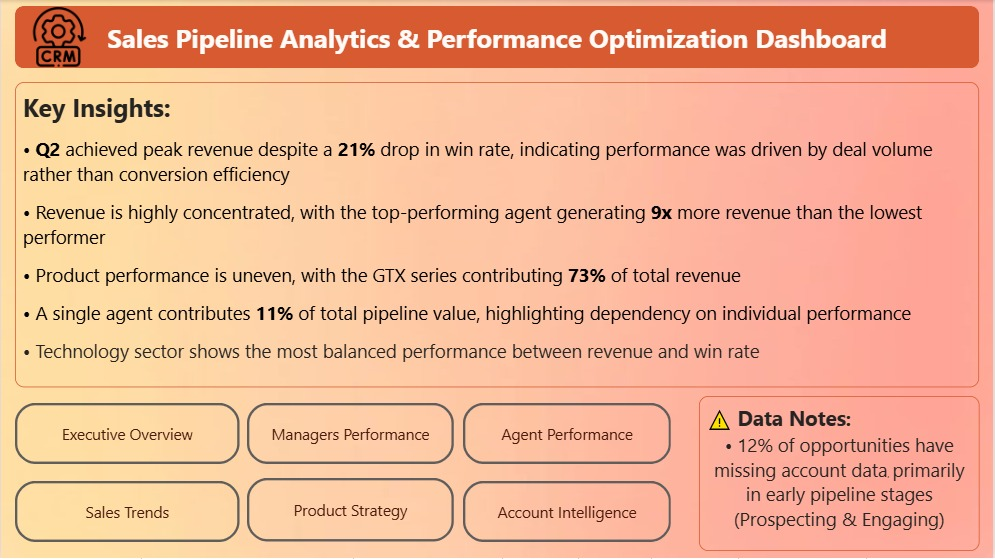
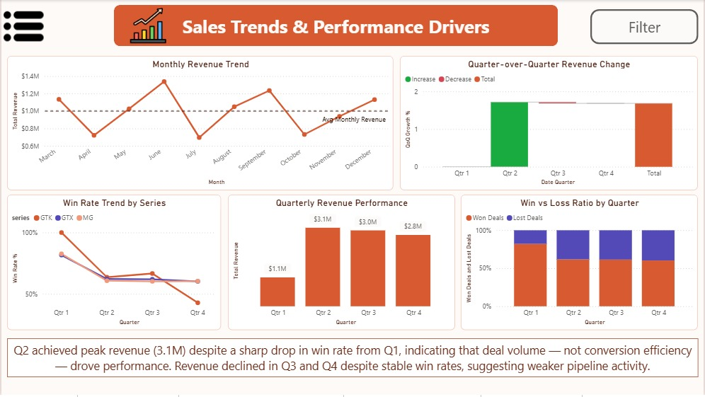
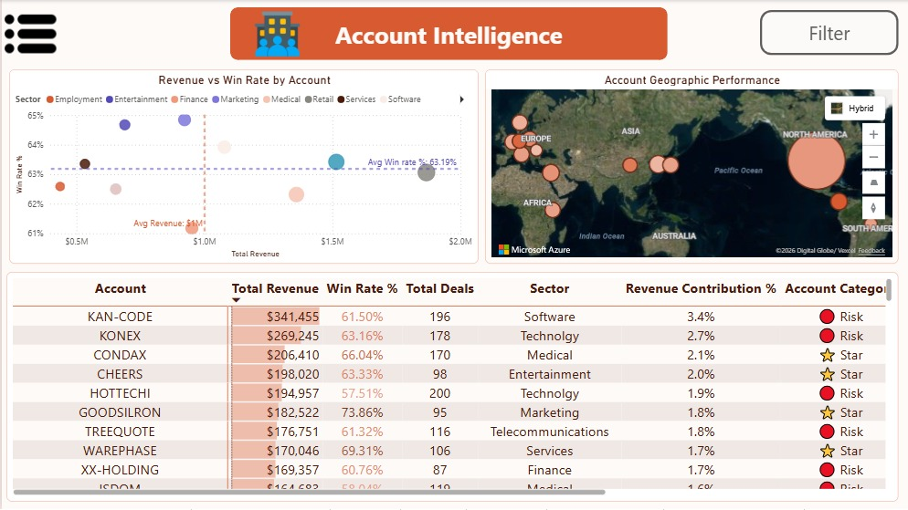

# B2B Sales Pipeline & Performance Analytics Dashboard
### Power BI | CRM Analytics | Maven Analytics Dataset
---

## 📋 Project Overview

A business intelligence dashboard analyzing **8,800+ B2B sales opportunities** to uncover performance drivers, revenue concentration risks, and product strategy insights.

Built using Power BI on a clean Star Schema data model with 15+ custom DAX measures, this project delivers a full 360° view of sales performance across teams, agents, products, and accounts.

> **Data Source:** [Maven Analytics — CRM Sales Opportunities Dataset](https://mavenanalytics.io/data-playground/crm-sales-opportunities)  
> **Tool:** Power BI Desktop  
> **Domain:** B2B Sales | CRM | Computer Hardware
---

## 🎥 Live Demo

👉 **Interactive Dashboard Walkthrough (Recommended):**  
🔗 https://vimeo.com/1182645961

---

## 📸 Dashboard Preview

👉 **View Dashboard Preview (PDF):**  
[b2b-sales-dashboard-preview](docs/b2b-sales-dashboard-preview.pdf)

| Landing Page | Sales Trends | Account Intelligence |
|--------------|--------------|---------------------|
|  |  |  |

> Full dashboard contains 7 interactive pages with drill-through, tooltips, and dynamic filtering.

---

## 📄 Full Documentation
👉 **Deep Dive Analysis Report:**  
[B2B Sales Pipeline Documentation](docs/b2b-sales-pipeline-documentation.pdf)

---

## 🎯 Business Questions

| # | Question |
|---|----------|
| 1 | What separates top-performing teams from the rest? |
| 2 | Which agents are underperforming — and why? |
| 3 | How did sales momentum shift across quarters? |
| 4 | Which products drive the highest win rates? |
| 5 | Which accounts and sectors generate the most value? |

---

## 💡 Key Findings

- **Win Rate dropped 21%** from Q1 (82%) to Q2 (61%), driven by deal volume — not conversion efficiency
- **Darcel Schlecht** generates **$1.15M** — nearly 9x more than the lowest-performing agent
- **GTX Series** accounts for **73% of total revenue** across all regions
- **GTK 500** is sold exclusively by **Celia Rouche's team** (West Region)
- **June** is the peak month ($1.34M), while **July** is the weakest ($700K)
- **Q2 achieved peak revenue ($3.1M)** despite a sharp Win Rate drop — volume, not efficiency, drove it
- **Technology sector** shows the best balance between Revenue and Win Rate

---

## 🔍 Key Insights & Business Analysis

> These insights were derived from analyzing 8,800 sales opportunities across agents, products, sectors, and time periods. Each finding is supported by data and framed around a business decision.

---

### 📌 Insight 1 — Revenue is Dangerously Concentrated in a Single Agent

**Finding:**
Darcel Schlecht alone generates **$1.15M — 11.5% of total company revenue ($10M)**.  
The top 5 agents account for **29.8% of revenue**, while the bottom 5 produce only **8.4% combined**.

| Segment | Revenue | % of Total |
|---------|---------|-----------|
| Top 1 Agent (Darcel) | $1,153,214 | 11.5% |
| Top 3 Agents | $2,085,000 | 20.8% |
| Top 5 Agents | $2,983,000 | 29.8% |
| Bottom 5 Agents | $836,000 | 8.4% |

**Business Risk:**  
If the top agent leaves, the company loses over 10% of revenue overnight — with no evident succession plan visible in the pipeline.

**Action:**  
→ Identify what Darcel does differently (deal size, product focus, close speed).  
→ Build a playbook and replicate across underperforming agents.  
→ Consider revenue caps or team redistribution to reduce single-agent dependency.

---

### 📌 Insight 2 — Q2 Peak Was Built on Volume, Not Quality (Hidden Fragility)

**Finding:**  
Q2 2017 hit peak revenue of **$3.1M (+172% QoQ)** — but Win Rate simultaneously **collapsed from 82% to 61.7%**.  
Q3 and Q4 show continued revenue decline (-3.4%, -6.0%) despite stable Win Rates around 61%.

| Quarter | Revenue | Win Rate | QoQ |
|---------|---------|----------|-----|
| Q1 2017 | $1.13M | 82.1% | — |
| Q2 2017 | $3.09M | 61.7% | +172% |
| Q3 2017 | $2.98M | 61.4% | -3.4% |
| Q4 2017 | $2.80M | 60.3% | -6.0% |

**What this means:**  
Q2 growth was driven by flooding the pipeline with low-quality deals — not by improving conversion. The team chased volume over efficiency. Q1's 82% Win Rate suggests the team can perform at a much higher level, but the Q2 surge masked a structural problem.

**Action:**  
→ Investigate Q1 conditions: Was Q1 a smaller, more selective pipeline?  
→ Set Win Rate floors (e.g., minimum 65%) alongside revenue targets.  
→ Avoid rewarding agents purely on deal count — reward on closed revenue.

---

### 📌 Insight 3 — MG Special is a Pricing Problem Disguised as a Sales Win

**Finding:**  
MG Special has the **highest Win Rate of all products (64.8%)** — yet contributes only **0.4% of total revenue** ($43,768 from 1,223 deals).

| Product | Win Rate | Revenue | Contribution | Price |
|---------|----------|---------|-------------|-------|
| MG Special | **64.8%** | $43,768 | **0.4%** | $55 |
| GTX Plus Pro | 64.3% | $2,629,651 | 26.3% | $5,482 |
| MG Advanced | 60.3% | $2,216,387 | 22.2% | $3,393 |

**What this means:**  
Agents are successfully selling MG Special — but the product is priced so low it barely moves the revenue needle. The company is expending real sales effort on a product that generates almost no return.

**Action:**  
→ Review MG Special pricing — is $55 justified?  
→ Redirect agent focus toward higher-margin products without sacrificing Win Rate.  
→ Consider bundling MG Special with GTX products to increase average deal size.

---

### 📌 Insight 4 — GTK 500 is a Single-Team Risk (and a Missed Opportunity)

**Finding:**  
GTK 500, priced at **$26,768** (the highest-priced product), is sold **exclusively by Celia Rouche's West Region team**.  
No other manager has meaningful GTK 500 revenue. GTK Win Rate also shows the steepest quarterly decline: **Q1: 100% → Q4: 43%**.

**Business Risk:**  
- If Celia's team underperforms, the company has zero coverage on its highest-priced product.  
- GTK 500 Win Rate collapse in Q4 (43%) is a warning sign not visible in aggregate metrics.

**Action:**  
→ Train at least one other regional team on GTK 500.  
→ Investigate Q4 Win Rate collapse — pricing objection? Competitive pressure?  
→ Add GTK 500 coverage as a strategic KPI for the sales leadership team.

---

### 📌 Insight 5 — Marketing Sector Punches Above Its Weight

**Finding:**  
The Marketing sector ranks **6th in revenue ($922K)** but has the **joint-highest Win Rate (64.8%)** — tied with MG Special's overall rate. Finance sector ranks 5th in revenue but has the **lowest Win Rate (61.2%)** among known sectors.

| Sector | Revenue | Win Rate | Opportunity Signal |
|--------|---------|----------|--------------------|
| Marketing | $922K | **64.8%** | ✅ High efficiency |
| Entertainment | $689K | 64.7% | ✅ High efficiency |
| Finance | $951K | 61.2% | ⚠️ Low conversion |
| Retail | $1.87M | 63.1% | 📊 Volume-driven |

**What this means:**  
Marketing and Entertainment sectors show superior conversion rates but lower revenue — likely due to smaller deal sizes or fewer accounts. Finance has the money but agents are losing deals more often.

**Action:**  
→ Allocate more senior agents to Finance to improve Win Rate on high-value opportunities.  
→ Expand Marketing sector account coverage — the conversion efficiency is there.

---

### 📌 Insight 6 — All Three Series Collapsed Simultaneously in Q2 (Systemic Issue)

**Finding:**  
All product series show an identical Win Rate pattern: **Q1 ~82-83%** dropping to **Q2 ~61-64%** with no recovery.

| Series | Q1 WR | Q2 WR | Q3 WR | Q4 WR |
|--------|-------|-------|-------|-------|
| GTX | 82% | 62% | 62% | 60% |
| MG | 83% | 61% | 60% | 60% |
| GTK | 100% | 64% | 67% | 43% |

**What this means:**  
The Win Rate drop was **not product-specific** — it happened across all series simultaneously. This rules out product quality or pricing as the cause. The Q2 pipeline flood was driven by a company-wide push.

**Action:**  
→ Q1 benchmarks should be the target — 82% Win Rate is achievable.  
→ Any future pipeline expansion should be paired with quality controls.  
→ GTK's Q4 collapse (43%) warrants separate investigation.

---

### 📌 Insight 7 — Team Size Doesn't Predict Revenue; Efficiency Does

**Finding:**  
All 6 managers lead exactly **5 agents each**. Yet revenue per agent varies significantly.

| Manager | Revenue | Win Rate | Rev / Agent |
|---------|---------|----------|------------|
| Melvin Marxen | $2.25M | 62.2% | $450K |
| Summer Sewald | $1.96M | **64.3%** | $393K |
| Cara Losch | $1.13M | **64.4%** | $226K |
| Dustin Brinkmann | $1.09M | 63.0% | **$219K** |

**The paradox:**  
Cara Losch has the **highest Win Rate (64.4%)** but the **lowest revenue per agent ($226K)**. This suggests high efficiency but low deal size.

**Action:**  
→ Increase deal size exposure for high-efficiency teams.  
→ Improve Win Rate for high-revenue teams.

---

## 🗄️ Data Model

### Star Schema

```
accounts_dim    ──(1)──(*) ──┐
products_dim    ──(1)──(*) ──┤──► sales_pipeline (Fact Table)
sales_teams_dim ──(1)──(*) ──┤
DateTable       ──(1)──(*) ──┘
```

---

## 📁 Repository Structure

```
CRM-Sales-Dashboard/
│
├── README.md
├── CRM_Sales_Performance.pbix
├── data/
└── dashboard_screenshots/
```

---

## 👤 Author

Built as a Portfolio Project | Power BI | DAX | Data Modeling

